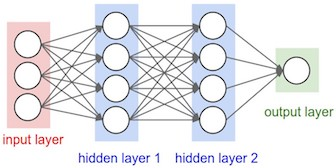

# Feed-Forward-Neural-Network-via-Tensorflow

A feedforward neural network is an artificial neural network wherein connections between the units do not form a cycle. The feedforward neural network was the first and simplest type of artificial neural network devised. In this network, the information moves in only one direction, forward, from the input nodes, through the hidden nodes (if any) and to the output nodes. There are no cycles or loops in the network.

In general, the problem of teaching a network to perform well, even on samples that were not used as training samples, is a quite subtle issue that requires additional techniques. This is especially important for cases where only very limited numbers of training samples are available. The danger is that the network overfits the training data and fails to capture the true statistical process generating the data. Computational learning theory is concerned with training classifiers on a limited amount of data. In the context of neural networks a simple heuristic, called early stopping, often ensures that the network will generalize well to examples not in the training set.
